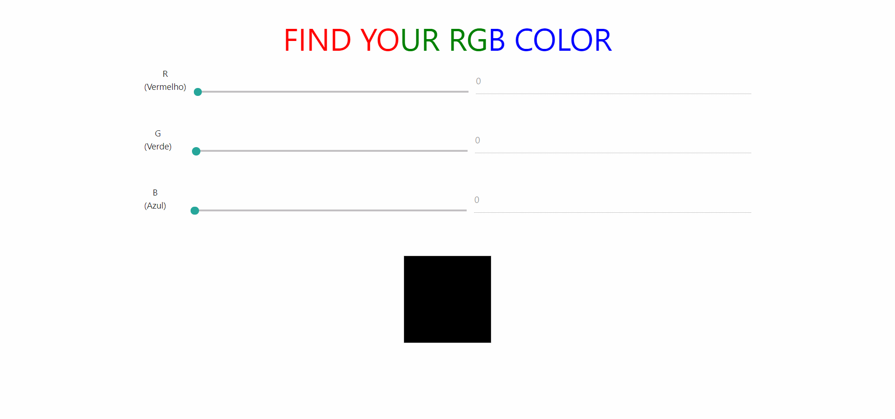

# Find your RGB colors

RGB color | Find your RGB colors easily!

 

 

## STACK

- Javascript
- HTML
- CSS
- NodeJS

 

<blockquote alt="[ignore]">

This project is free and can be used for everyone!

</blockquote>
